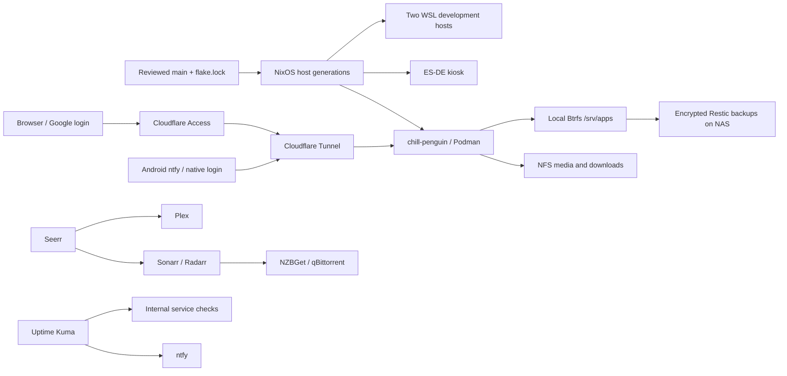

# Fleet operations and modernization

The 3.7.0 configuration was prepared from the September 2026 audit. Repository
validation is separate from native builds, activation, and live acceptance.

## How the fleet works

`flake.nix` constructs four NixOS hosts using shared role modules and Home
Manager. `flake.lock` pins the coordinated nixpkgs, Home Manager, hardware,
Apple Silicon, WSL, index, and secrets inputs. `chill-penguin` runs the
self-hosted inventory; the two WSL hosts run development tools; Boomer runs the
ES-DE kiosk. Secrets are age-encrypted provider/service bundles, decrypted by
host keys and projected under `/run/ghostship-secrets`.



Containers share `ghostship_net`; no new host ports are published. Plex keeps
its existing host exposure. qBittorrent shares Gluetun's VPN namespace. NZBGet
uses direct networking; its compatibility proxy preserves the old tunnel
origin. Network setup remains active after success to serve shared startup
dependencies. Both agent containers keep their own lifecycle and soft network
ordering so refreshing that setup unit cannot stop their work.
Media/download files live on the NAS, while app databases and settings
live locally. The backup repository covers local service state, not a second
copy of the bulk media library.

## Audit findings and changes

Apple Silicon support remains pinned to the compatible revision. Newer upstream
support requires `/boot/vendorfw/firmware.cpio`, rebuilt using the Asahi installer
from macOS; this server currently has `/boot/asahi/all_firmware.tar.gz`. Schedule
that firmware maintenance separately before advancing the hardware input. The
verified live bootloader is systemd-boot with an uncompressed ARM64 Image.

chill-penguin explicitly retains its running `dbus` implementation. The updated
nixpkgs default is `broker`; changing a running system bus requires a separate
reboot window. Keep that change outside live fleet updates so active agents can
continue running and the switch-inhibitor checks remain enabled.

| Finding | Change / remaining acceptance |
| --- | --- |
| Shell quoting reached Podman as literal characters | Separate shell-safe `.env` and raw `.env.container` projections; tested round trips |
| Missing values could silently blank critical settings | Required-secret writes for core arr/database config; atomic replacement preserves original files on failure |
| Activation mixed persistent config writes with service lifecycle | Generate app configuration in `preStart`, after runtime secret projection |
| Network, NAS, and database startup dependencies were inconsistent | Explicit dependencies and NAS mount checks; native health readiness for long-running apps |
| Floating MariaDB engines could migrate before a recovery point | Pin the audited live digests; reviewed engine changes and logical exports |
| No managed recovery or freshness gate | Nightly encrypted backups, checks, retention, restore command, and recent-backup requirement before container updates |
| Retirement could destroy state or affect active development | Quarantine inactive allowlisted paths; preserve active artifacts and Codex |
| No fleet CI or coordinated dependency updates | Evaluate all host derivations, test configuration and failure handling, lint workflows/scripts, scan source for secrets; weekly draft update PRs |
| README described retired apps and manual kiosk startup as current | Correct declared inventory and kiosk behavior |
| Input refresh exposed renamed SSH options / ragenix incompatibility | Use current Home Manager option names with the same policy and nixpkgs ragenix CLI |

No SSH authorization policy change or general Cloudflare policy audit is included.
OpenChamber remains the primary agent; the existing Codex workstation is retained.
OpenChamber updates use validated immutable generations and coordinated drain
checks, including pending goal continuations. Provider retries are observed
without aborting the task. See the OpenChamber stability document for recovery.

## Added services

| Service | Internal origin | Public hostname | Purpose and authentication |
| --- | --- | --- | --- |
| Uptime Kuma 2 | `http://uptime-kuma:3001` | `uptime.ghostship.io` | Internal HTTP/TCP checks plus backup/update heartbeats; existing Google Access policy, then local `james` account |
| ntfy | `http://ntfy:8080` | `ntfy.ghostship.io` | Android operations notifications; native authentication, no browser-login redirect |
| Seerr | `http://seerr:5055` | `requests.ghostship.io` | Plex requests routed to existing Sonarr/Radarr profiles and roots; existing Google Access policy plus Plex login |

Monitoring provisioning creates missing `Ghostship ...` entries from the same
registry. HTTP target URLs follow the registry; existing notification and
interval choices are preserved. Independently added monitors remain untouched. HTTP checks distinguish successful responses
from redirects; database/download services without a reliable public HTTP
probe use TCP checks. A five-minute local heartbeat reports stale backup
(30 hours) or update (36 hours) success markers. Missing heartbeat delivery is
also detected by Kuma. Same-host monitoring cannot deliver an alert during a
complete host, power, or tunnel outage; an independent external check remains a
useful later addition.

ntfy denies anonymous access and signup. `publisher` can write only to
`operations`; `android` can read only that topic; `james` administers the
instance. Open `secret-edit monitoring` privately to retrieve credentials:
`KUMA_PASSWORD` is the initial Kuma and ntfy administrator password;
`NTFY_READER_PASSWORD` is the Android subscriber password. In the Android ntfy
app, add server `https://ntfy.ghostship.io`, user `android`, and topic
`operations`. No iOS relay or WARP dependency is configured. A manual
`ghostship-alert 'Ghostship notification test'` checks delivery after rollout.

Seerr provisioning authenticates using the existing Plex token, selects the
existing `Optimal` quality profile (or an unambiguous sole profile), and
requires `/tv` and `/movies` roots already present in Sonarr/Radarr. It fails
rather than choosing among ambiguous alternatives. Ordinary users receive
REQUEST permission only, without auto-approval. Library setup supports both the
released query-based API and the newer POST/PUT API. Legacy queries include any
enabled library IDs because omitting them disables selections; the parameter is
omitted only for an intentionally empty selection, since empty values are rejected.
New Plex users require explicit import. After successful first-run setup, the marker
`/srv/apps/seerr/.ghostship-provisioned` preserves later settings. Verify a
request as an ordinary user remains pending until an administrator approves it.

The new credentials are encrypted in the service source bundles. Do not store
runtime env files, setup cookies, push tokens, or plaintext exports in Git.

## One service declaration for Cloudflare and dashboards

Each container module declares a `ghostship.apps.<container>` entry. That is
now the common source for public hostnames, internal origins, Homepage widgets,
Muximux navigation, and HTTP monitoring targets. For example:

```nix
ghostship.apps.sonarr = {
  name = "Sonarr";
  group = "Automation";
  hostname = "sonarr.ghostship.io";
  origin = "http://sonarr:8989";
  healthPath = "/ping";
  icon = "sh-sonarr";
  widget = { type = "sonarr"; key = "env:SONARR_API_KEY"; };
  muximux = { icon = "muximux-sonarr"; color = "#35c5f4"; };
};
```

Both dashboards generate their links from `hostname`, and widget URLs default
to `origin`. RomM, Grimmory, and PyLoad retain explicit same-origin Muximux proxy
paths. Internal-only helpers omit `hostname` and `origin`, so they receive no
public DNS/tunnel route or Muximux link. Dashboard names must be unique and
each registry entry must refer to a declared container. Changes are rendered at
dashboard startup; the generated manifest changes their unit scripts, causing
NixOS to restart the affected dashboards on a switch.

The renderer tracks its previous names under `/var/lib/ghostship-dashboards`.
Renames/removals delete previously managed entries while preserving unrelated
links, Calendar, shared settings, and unknown per-entry fields. Registry-owned
fields and widgets are authoritative; edit their module to make changes stick.
Adding another public container needs one app declaration, not three separate
lists. Keep its Homepage secrets projection current when adding widget keys.

`ghostship-cloudflare-sync.service` reads that manifest and reconciles the
existing remote-managed tunnel and proxied CNAME records at activation/boot and
every six hours. It does not create or replace the tunnel itself. From the
server's root shell:

```bash
ghostship-cloudflare-sync             # show plan; no Cloudflare writes
ghostship-cloudflare-sync --apply     # reconcile immediately
```

Only declared exact hostnames are adopted. Unknown tunnel rules, global tunnel
settings, DNS records, and external Synology/SSH routes remain intact. Existing
origin-request settings are preserved. Conflicting DNS record types or duplicate
managed tunnel rules cause a failure instead of guessing. Before the first
rollout, remove only the shadowed legacy `codex-web:8214` rule for
`codex.ghostship.io`, preserving the first, live `codex:8214` rule and a
private snapshot of the original tunnel configuration. Codex then joins the
same registry without changing its effective public route.

Managed DNS records carry a Nix ownership comment. Previous managed names are
recorded under `/var/lib/ghostship-cloudflare`; removals delete only records
with that marker pointing to this tunnel. The ownership union is recorded before
writes so partial runs can converge on retry. Remote state snapshots are saved
privately under its `history` directory before mutations. These directories are
included in backups; losing the ownership manifest can leave retired records
behind and requires inspecting the saved history. Unrelated manual records are
never automatically deleted. Synchronization uses a local lock and checks for
concurrent tunnel changes before writing; Cloudflare does not provide an atomic
transaction across Access, tunnel configuration, and DNS.

Browser services must already be covered by the existing Google Access policy.
The reconciler validates that coverage and refuses unexpected bypass policies;
it does not rewrite the shared wildcard or identity rules. ntfy alone receives
a specific Access application with a bypass policy so its native authentication
works from Android. Its server denies anonymous access and signup. If that
specific app exists outside this manager or its policy has drifted, sync stops
for inspection. No other service can request the native-auth exception.

After rollout, verify unauthenticated browser requests redirect to Google Access,
allowed users reach the apps, anonymous ntfy reads/publishes return 401/403, and
the Android read-only user receives a test but cannot publish. Keep frame
protections; use a separate tab where an application or Access requires it.

The API credential lives in the encrypted `cloudflare` source bundle. Create a
custom token under Cloudflare **My Profile → API Tokens** with Account
**Cloudflare Tunnel: Edit**, Account **Access: Apps and Policies: Edit**, Zone
**DNS: Edit**, and Zone **Zone: Read**, restricted to the hosting account and
`ghostship.io`. Use `secret-edit cloudflare` and change only `API_TOKEN` in
`secrets/files/sources/providers/cloudflare.env.age`. The reconciler consumes a
root-only runtime projection; no credential enters the Nix store, application
projections, or process arguments. Homepage shows Cloudflared container status
instead of receiving this management token for its API widget. Keep the connector's `TUNNEL_TOKEN` unchanged. The replacement token
passed Access, tunnel configuration, and zone read checks; publication waits
for the reviewed host deployment.

## Backups and recovery

From a root shell on `chill-penguin`:

```bash
ghostship-backup backup
ghostship-backup check
ghostship-backup sample
ghostship-backup restore-check
```

The backup command holds a maintenance lock shared with Podman auto-update,
requires a real NFS mount, and uses the encrypted `backup` secret. It briefly
pauses the active RomM/Grimmory containers, exports both MariaDB engines,
snapshots `/srv` read-only (or the root subvolume when `/srv` is an ordinary
directory in the declared root layout), and resumes the same containers before transferring
the snapshot. Health recovery is disabled during the bounded pause and restored
afterward; no image pull or service restart occurs. Exact image IDs and the
generation manifest are recorded before pausing.
SQLite databases and WAL files are captured together. Failure handling resumes
containers it paused and restores their health-check settings and removes the temporary Btrfs snapshot.

Restic stores encrypted snapshots under
`/mnt/share/Backups/ghostship/chill-penguin`. Backup selection includes app
state, logical MariaDB exports, image/generation manifests, SSH host keys, and
Apple Silicon firmware. Raw MariaDB directories, the retired Codex directory,
both agent containers' nested Docker and Nix stores, node_modules, and caches
are excluded. Current ChatGPT and OpenChamber home/workspace state is included. OpenChamber's
remaining local files are snapshot-backed without stopping it; its nested
Docker volumes need a separate application-aware recovery decision in the
agent recovery procedure. Nested Btrfs subvolumes are not recursively included
by a parent snapshot; review coverage before adding any under `/srv/apps`.

Timers run nightly at 23:00 UTC for backups, Sunday 21:00 for repository checks,
monthly on day 1 at 20:00 for a 10% data sample, and Sunday 19:00 for pruning,
with up to ten minutes of jitter. Retention keeps 7 daily, 5 weekly, and 12
monthly snapshots. Failed checks alert through ntfy. An update is deferred if
no successful backup is newer than 30 hours. This gate protects scheduled
Podman updates; operator-triggered rebuilds must run the same backup step.

`restore-check` restores the new services' state and SQL exports into a unique
root-only directory under `/var/lib/ghostship-backup`. It runs SQLite integrity
checks and imports both dumps into disposable MariaDB containers with no
network or live-volume mounts. The disposable volume is initialized normally,
then reopened with grant checks disabled for logical imports. Anonymous volumes
and scratch data are removed after successful probes. This bootstrap/import
sequence passed a native ARM smoke test with fixture databases on chill-penguin;
a production backup restore is still a rollout acceptance step. Failed restore files remain for inspection;
successful checks remove them. Run it after the first backup and periodically,
and before a database engine upgrade. This drill does not prove full service
recovery, identity login, or every application's file coverage.

For actual recovery, stop the affected writers, restore to a separate directory,
and inspect ownership and versions before replacing app paths. Import logical
SQL dumps into a fresh instance of the recorded database image, then start the
matching application image and verify real application operations. Rolling back
a Nix generation or container image alone does not reverse database migrations.
Preserve the previous app directories until that verification succeeds. Keep an
off-host copy of the age editing/recovery key; a NAS backup alone does not cover
loss of both the server and its recovery keys, or site-wide loss.

## Updates and staged rollout

Registry-labeled applications keep native Podman automatic updates with health
readiness and rollback. Database digests require review. OpenChamber retains its
existing activity-aware update behavior. Recyclarr stays on supported major 8.
Nix system updates deploy committed `main` and its lock, with no local input
refresh. The weekly workflow proposes a coordinated lock change with a patch
version and changelog, validates before opening a draft PR, and never merges or
switches hosts. PRs created with `GITHUB_TOKEN` do not automatically trigger a
second workflow run; use the update workflow's validation and explicitly run
Fleet checks after review when needed.

1. Merge reviewed changes after CI. Preserve the running Codex container.
   Prestage and validate OpenChamber before its one controlled legacy restart.
2. On a WSL canary, build the merged configuration, inspect changes, switch at
   an idle time, and check shells, agent launchers, SSH agent, and NFS. Then
   repeat for the second WSL host. Do not rebuild both concurrently.
3. On `chill-penguin`, pull merged main, build natively (use `--impure` if local
   Apple firmware extraction requires it), take the initial backup using the
   new generation's backup command and decrypted backup projection, then switch.
   Use the bootstrap commands below during the controlled maintenance window.
4. Check failed units, container health, NAS mounts, configuration file modes,
   secret-dependent integrations, and active agent sessions. Run a backup,
   repository check, and isolated restore check before enabling confidence in
   automatic upgrades. Verify update rollback using a disposable failing image.
5. Verify automatic Cloudflare reconciliation, then validate Google browser login and Android
   notifications. Test Seerr approval and the existing dashboards/media flows.
6. Boomer is intentionally deferred while offline. Its local licensed PICO-8
   archive and Apple-specific firmware cannot be supplied by generic CI.

CI evaluates all host derivations without building the fleet, builds the config
writer, runs regression tests, checks shell/workflow syntax, and scans the source
for secrets. It does not claim native ARM builds, live container startup, secret
decryption on every host, GPU/controller acceptance, or successful restore drills.

For the first backup only, from the built checkout in the server's root shell
(the source bundle exports the same `RESTIC_PASSWORD` as its projection):

```bash
umask 077
mkdir -p /run/ghostship-secrets
install -d -m0700 /var/lib/ghostship-backup /var/cache/ghostship-backup
nix develop -c age -d -i /etc/ssh/ssh_host_ed25519_key \
  secrets/files/sources/services/backup.env.age \
  > /run/ghostship-secrets/backup.env.new
mv /run/ghostship-secrets/backup.env.new /run/ghostship-secrets/backup.env
./result/sw/bin/ghostship-backup backup
./result/sw/bin/ghostship-backup restore-check
```

Run these sequentially, stopping on any error. Do not activate the new system
until both commands succeed and the OpenChamber candidate is validated.
The normal secret projection owns this file after activation. If a hard kill
interrupts the backup process, inspect `podman ps` for paused RomM/Grimmory
containers and unpause them; their declarative health settings are restored by
the next normal unit start. Signal/error traps handle ordinary failures.

## Upstream contracts

- [Podman auto-update readiness and rollback](https://docs.podman.io/en/latest/markdown/podman-auto-update.1.html)
- [ntfy configuration, authentication, and ACLs](https://docs.ntfy.sh/config/)
- [Kuma v2 server API](https://github.com/louislam/uptime-kuma/blob/2.0.0/server/server.js)
- [Seerr settings API](https://github.com/seerr-team/seerr/blob/develop/server/routes/settings/index.ts)
- [Cloudflare custom tokens](https://developers.cloudflare.com/fundamentals/api/get-started/create-token/)
